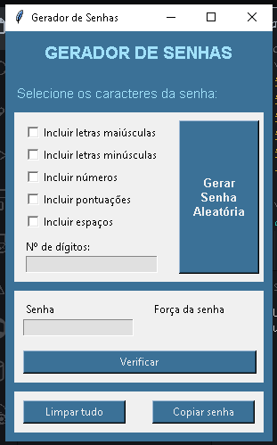
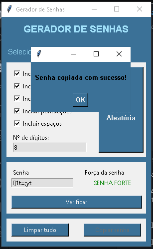

# Password Generator Application README

## Introduction
This README provides a detailed description of the "Password Generator" application developed using Python and the tkinter library. This application allows users to generate random passwords with various customization options and check the strength of the generated password.

## Table of Contents
- [Features](#features)
- [Installation](#installation)
- [How to Use](#how-to-use)
- [Screenshots](#screenshots)
- [Contributing](#contributing)
- [License](#license)

## Features

### 1. Customizable Password Generation
- Select from various character sets:
  - Uppercase letters (A-Z)
  - Lowercase letters (a-z)
  - Digits (0-9)
  - Punctuation symbols (e.g., !@#$%^)
  - Whitespace characters
- Specify the length of the password.

### 2. Password Strength Checking
- Check the strength of the generated password.
- Get feedback on whether the password is strong or weak.

### 3. Copy to Clipboard
- Easily copy the generated password to the clipboard.
- Receive a confirmation message when the password is successfully copied.

### 4. User-Friendly Interface
- Attractive graphical user interface (GUI) designed with tkinter.
- Intuitive layout and controls for ease of use.

## Installation

Follow these steps to run the Password Generator application on your local machine:

1. Make sure you have Python 3.x installed. You can download it from [Python's official website](https://www.python.org/downloads/).

2. Clone the GitHub repository or download the ZIP file containing the source code.

3. Extract the ZIP file if you downloaded it.

4. Open a terminal or command prompt and navigate to the project's directory.

5. Install any required packages. You may need to install the `clipboard` library using pip:

   ```
   pip install clipboard
   ```

6. Run the application by executing the following command:

   ```
   python password_generator.py
   ```

## How to Use

1. Launch the Password Generator application.

2. Select the character sets you want to include in your password by checking or unchecking the corresponding checkboxes.

3. Specify the desired length of the password in the "Nº de dígitos" field.

4. Click the "Gerar Senha Aleatória" button to generate a random password. The password will be displayed in the "Senha" field.

5. To check the strength of the generated password, click the "Verificar" button. The password strength will be displayed as "SENHA FORTE" or "SENHA FRACA" in the "Força da senha" field.

6. If you want to copy the generated password to your clipboard, click the "Copiar senha" button. A confirmation message will be displayed when the copy is successful.

7. To clear all selections and input fields, click the "Limpar tudo" button.

## Screenshots

Here are some screenshots of the Password Generator application:





## Contributing

If you'd like to contribute to this project, please follow these guidelines:

1. Fork the repository to your own GitHub account.

2. Clone the project to your local machine.

3. Create a new branch for your feature or bug fix:

   ```
   git checkout -b feature/your-feature
   ```

4. Make your changes and test them thoroughly.

5. Commit your changes with descriptive commit messages:

   ```
   git commit -m "Add feature or fix bug"
   ```

6. Push your changes to your GitHub account:

   ```
   git push origin feature/your-feature
   ```

7. Create a pull request to the main repository's `master` branch.

8. Your pull request will be reviewed, and once approved, it will be merged into the main project.

## License

This project is licensed under the MIT License. See the [LICENSE](LICENSE) file for details.

---

Feel free to use, modify, and share this Password Generator application as needed. If you encounter any issues or have suggestions for improvements, please open an issue or pull request. Enjoy generating secure passwords with this application!
